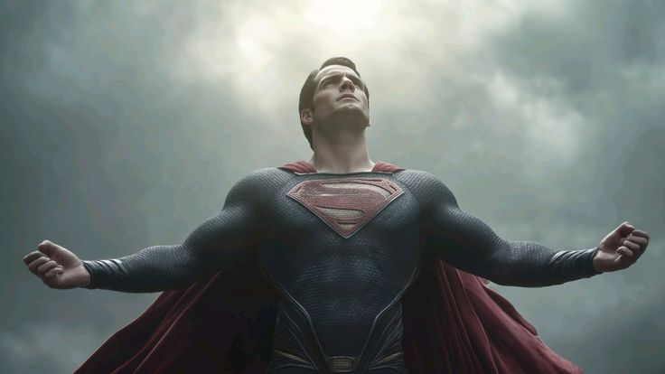

# Kal-El: Legacy of Krypton

A stunning, immersive web experience dedicated to the lore of Superman (Kal-El). Built with modern web technologies, this project features high-end animations, parallax effects, and interactive elements to tell the story of the Man of Steel.

 
*(Note: Replace with a representative screenshot if available)*

## 🚀 Technologies

*   **Framework**: [React](https://react.dev/) + [Vite](https://vitejs.dev/)
*   **Styling**: [Tailwind CSS](https://tailwindcss.com/)
*   **Animations**: 
    *   [GSAP](https://gsap.com/) (ScrollTrigger, Flip)
    *   [React Spring](https://www.react-spring.dev/) (Parallax)
*   **Routing**: React Router DOM

## ✨ Features

*   **Immersive Home Page**: Visually striking landing page with Superman-themed aesthetics.
*   **Fortress of Solitude**: Interactive "Suits" gallery using GSAP Flip for seamless transitions and ScrollTrigger for parallax depth.
*   **Clark Kent Section**: A glimpse into the human side of the hero.
*   **Legacy (Last Page)**: A mesmerizing interactive finale featuring a **3D Image Trail** effect that reacts to mouse movement, showcasing the history of the character.
*   **Responsive Design**: Optimized for various screen sizes.

## 🛠️ Installation & Run

1.  **Clone the repository**:
    ```bash
    git clone https://github.com/Jaswanth-dev-69/superman.git
    cd superman/website/kal-el
    ```

2.  **Install dependencies**:
    ```bash
    npm install
    ```

3.  **Run the development server**:
    ```bash
    npm run dev
    ```

4.  **Build for production**:
    ```bash
    npm run build
    ```

## 📂 Project Structure

*   `src/components`: Reusable UI components (Navbar, ImageTrail, etc.).
*   `src/pages`: Main page views (Home, Clark, Fortress, LastPage).
*   `public/images`: Static assets for backgrounds and galleries.

## 🎨 Credits

*   Design inspiration: Man of Steel, DC Comics.
*   Image Trail Effect: Adapted from React Bits.

---

*Made with ❤️ for the House of El.*
